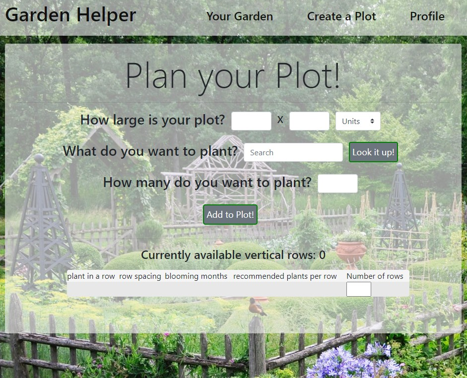
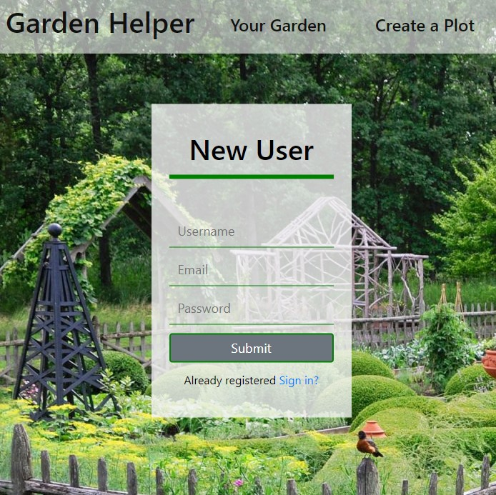

# GardenHelper Frontend 

Garden Helper is a React app that allows users to plan and store their ideal gardens. utilizes the Trefle API to provide plant information.



## Installation
clone repo then 

```bash
npm install
```
to install dependencies

## Usage

```node.js
npm start
```

must have backend from https://github.com/todayisfineforme/GardenHelper.Backend installed and running, with a mongoose server running as well.

create a new user or sign in with existing username



you can then add to you garden plots and generate new separate plots as well.

## Contributing

Pull requests are welcome. For major changes, please open an issue first to discuss what you would like to change.

## License

[MIT](https://choosealicense.com/licenses/mit/)
